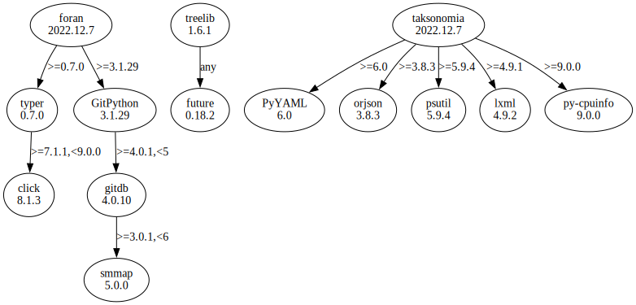

# Third Party Dependencies

<!--[[[fill sbom_sha256()]]]-->
The [SBOM in CycloneDX v1.4 JSON format](https://github.com/sthagen/pilli/blob/default/sbom.json) with SHA256 checksum ([dc3a0d1f ...](https://raw.githubusercontent.com/sthagen/pilli/default/sbom.json.sha256 "sha256:dc3a0d1f645e182e7026d87e29c620a7a2137d9977017554b488bb2a3c328ab1")).
<!--[[[end]]] (checksum: 7cf11440c137b08e10372ce4c3fcdd53)-->
## Licenses 

JSON files with complete license info of: [direct dependencies](direct-dependency-licenses.json) | [all dependencies](all-dependency-licenses.json)

### Direct Dependencies

<!--[[[fill direct_dependencies_table()]]]-->
| Name                                             | Version                                          | License                 | Author            | Description (from packaging data)                                  |
|:-------------------------------------------------|:-------------------------------------------------|:------------------------|:------------------|:-------------------------------------------------------------------|
| [PyYAML](https://pyyaml.org/)                    | [6.0](https://pypi.org/project/PyYAML/6.0/)      | MIT License             | Kirill Simonov    | YAML parser and emitter for Python                                 |
| [treelib](https://github.com/caesar0301/treelib) | [1.6.1](https://pypi.org/project/treelib/1.6.1/) | Apache Software License | Xiaming Chen      | A Python 2/3 implementation of tree structure.                     |
| [typer](https://github.com/tiangolo/typer)       | [0.7.0](https://pypi.org/project/typer/0.7.0/)   | MIT License             | Sebastián Ramírez | Typer, build great CLIs. Easy to code. Based on Python type hints. |
<!--[[[end]]] (checksum: 47b90387514cce074bb99212f2809060)-->

### Indirect Dependencies

<!--[[[fill indirect_dependencies_table()]]]-->
| Name                                          | Version                                        | License     | Author         | Description (from packaging data)         |
|:----------------------------------------------|:-----------------------------------------------|:------------|:---------------|:------------------------------------------|
| [click](https://palletsprojects.com/p/click/) | [8.1.3](https://pypi.org/project/click/8.1.3/) | BSD License | Armin Ronacher | Composable command line interface toolkit |
<!--[[[end]]] (checksum: dc3a866a7aa3332404bde3da87727cb9)-->

## Dependency Tree(s)

JSON file with the complete package dependency tree info of: [the full dependency tree](package-dependency-tree.json)

### Rendered SVG

Base graphviz file in dot format: [Trees of the direct dependencies](package-dependency-tree.dot.txt)



### Console Representation

<!--[[[fill dependency_tree_console_text()]]]-->
````console
PyYAML==6.0
treelib==1.6.1
  - future [required: Any, installed: 0.18.2]
typer==0.7.0
  - click [required: >=7.1.1,<9.0.0, installed: 8.1.3]
````
<!--[[[end]]] (checksum: e5ff21ad12642b3462a4b27e7c9c7e30)-->
