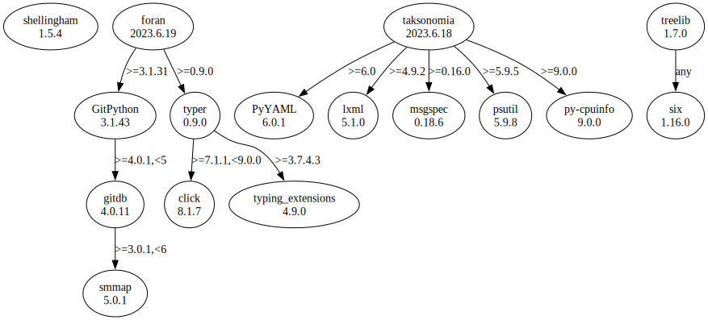

# Third Party Dependencies

<!--[[[fill sbom_sha256()]]]-->
The [SBOM in CycloneDX v1.4 JSON format](https://git.sr.ht/~sthagen/liitos/blob/default/sbom/cdx.json) with SHA256 checksum ([13953429 ...](https://git.sr.ht/~sthagen/liitos/blob/default/sbom/cdx.json.sha256 "sha256:139534292f73a37f6f9858f8cf628ba73ecea6a13a7b1661420e07c919468285")).
<!--[[[end]]] (checksum: e6cc35795f04624a13c30429a2084a43)-->
## Licenses 

JSON files with complete license info of: [direct dependencies](direct-dependency-licenses.json) | [all dependencies](all-dependency-licenses.json)

### Direct Dependencies

<!--[[[fill direct_dependencies_table()]]]-->
| Name                                                | Version                                                     | License                 | Author                           | Description (from packaging data)                                                                                                         |
|:----------------------------------------------------|:------------------------------------------------------------|:------------------------|:---------------------------------|:------------------------------------------------------------------------------------------------------------------------------------------|
| [PyYAML](https://pyyaml.org/)                       | [6.0.1](https://pypi.org/project/PyYAML/6.0.1/)             | MIT License             | Kirill Simonov                   | YAML parser and emitter for Python                                                                                                        |
| [foran](https://git.sr.ht/~sthagen/foran)           | [2023.6.19](https://pypi.org/project/foran/2023.6.19/)      | MIT License             | Stefan Hagen <stefan@hagen.link> | In front or behind (Danish: foran eller bagved)? Answering the question if a local repository status is in front of or behind its remote. |
| [taksonomia](https://git.sr.ht/~sthagen/taksonomia) | [2023.6.18](https://pypi.org/project/taksonomia/2023.6.18/) | MIT License             | Stefan Hagen <stefan@hagen.link> | Taxonomy (Finnish: taksonomia) of a folder tree, guided by conventions.                                                                   |
| [treelib](https://github.com/caesar0301/treelib)    | [1.6.4](https://pypi.org/project/treelib/1.6.4/)            | Apache Software License | Xiaming Chen                     | A Python 2/3 implementation of tree structure.                                                                                            |
| [typer](https://github.com/tiangolo/typer)          | [0.9.0](https://pypi.org/project/typer/0.9.0/)              | MIT License             | Sebastián Ramírez                | Typer, build great CLIs. Easy to code. Based on Python type hints.                                                                        |
<!--[[[end]]] (checksum: 5b69fb3ced8abd214f48fe9ffbe74abe)-->

### Indirect Dependencies

<!--[[[fill indirect_dependencies_table()]]]-->
| Name                                                           | Version                                              | License     | Author                         | Description (from packaging data)                                                                |
|:---------------------------------------------------------------|:-----------------------------------------------------|:------------|:-------------------------------|:-------------------------------------------------------------------------------------------------|
| [GitPython](https://github.com/gitpython-developers/GitPython) | [3.1.32](https://pypi.org/project/GitPython/3.1.32/) | BSD License | Sebastian Thiel, Michael Trier | GitPython is a Python library used to interact with Git repositories                             |
| [click](https://palletsprojects.com/p/click/)                  | [8.1.6](https://pypi.org/project/click/8.1.6/)       | BSD License | UNKNOWN                        | Composable command line interface toolkit                                                        |
| [gitdb](https://github.com/gitpython-developers/gitdb)         | [4.0.10](https://pypi.org/project/gitdb/4.0.10/)     | BSD License | Sebastian Thiel                | Git Object Database                                                                              |
| [lxml](https://lxml.de/)                                       | [4.9.3](https://pypi.org/project/lxml/4.9.3/)        | BSD License | lxml dev team                  | Powerful and Pythonic XML processing library combining libxml2/libxslt with the ElementTree API. |
| [psutil](https://github.com/giampaolo/psutil)                  | [5.9.5](https://pypi.org/project/psutil/5.9.5/)      | BSD License | Giampaolo Rodola               | Cross-platform lib for process and system monitoring in Python.                                  |
| [py-cpuinfo](https://github.com/workhorsy/py-cpuinfo)          | [9.0.0](https://pypi.org/project/py-cpuinfo/9.0.0/)  | MIT License | Matthew Brennan Jones          | Get CPU info with pure Python                                                                    |
| [smmap](https://github.com/gitpython-developers/smmap)         | [5.0.0](https://pypi.org/project/smmap/5.0.0/)       | BSD License | Sebastian Thiel                | A pure Python implementation of a sliding window memory map manager                              |
<!--[[[end]]] (checksum: 6806a52cef667802406da6a24220b905)-->

## Dependency Tree(s)

JSON file with the complete package dependency tree info of: [the full dependency tree](package-dependency-tree.json)

### Rendered SVG

Base graphviz file in dot format: [Trees of the direct dependencies](package-dependency-tree.dot.txt)



### Console Representation

<!--[[[fill dependency_tree_console_text()]]]-->
````console

````
<!--[[[end]]] (checksum: 3c785458cb78583f093698f578ae7d19)-->
