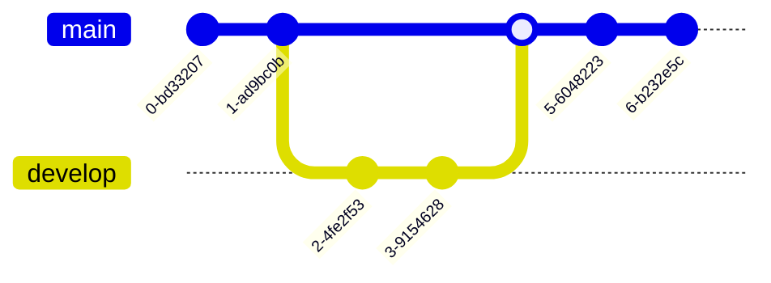

# 1

Top 1 with include.

```{.python .cb.run}
with open('part/a.md') as fp:
    print(fp.read())
```


## References

\option[style=multiline,leftmargin=6em]

\normalfont \[CODE-A]
:    Term has no bold style attached, A book, a manuscript, and all that, 2021, City, Country, URL=<https://example.com/code-a>

\[CODE-C]
:    A Cook, a manuscript, and all that, 2022, City, Country, \mbox{hy-phe-nation-test-please-do-not-find-this-lterm-broken}

\[CODE-BIT-LONG]
:    A bit, a manuscript, and all that, 2023, City, Country,\hfill \break
hy-phe-nation-test-please-do-not-find-this-lterm-broken

Now for something completely different:

Italic: *Italic text* or _Italic text_

Bold: **bold text** or __bold text__

Strikethrough: ~~strikethrough text~~

Fixed: `courier` or ``courier``

## A Mermaid or Two

There is a mermaid in Fig.\ \ref{fig:kaptain}

\scale=50%

```{.mermaid caption="Kaptain!\label{fig:kaptain}" filename=kaptain-mermaid loc=images format=png width=1200}
graph TD
    A[Christmas] -->|Get money| B(Go shopping)
    B --> C{Let me think}
    C -->|One| D[Laptop]
    C -->|Two| E[iPhone]
    C -->|Three| F[fa:fa-car Car]
```

And here is another (vanishing in the transition to PDF):

\scale=75%



Back into the ocean.
