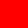
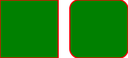

# B

Yes.

Yes, an SVG file:

And another one with application hinting suffices:

**Some bold text** normal text _italic text_ - even _**bold italic**_ and so ***123*** on.

Enumerated list:

1. wun
1. two
1. three

