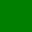

# Design

Now we really write down details.

Pictures with labels \ref{fig:green} to be injected:

{width=95% height=32px}

And, did it work?

## Tables

A table:

| Left | Middle | Right |
|:-----|:------:|------:|
| L    |   CC   |     R |
| l    |   Cc   |     R |
| L    |   cC   |     r |
A caption \label{tab:sweet-and-lovely}

Some real paragraph of dense text representing deep thoughts about appearance.
Some real paragraph of dense text representing deep thoughts about appearance.
Some real paragraph of dense text representing deep thoughts about appearance.
Some real paragraph of dense text representing deep thoughts about appearance.
Some real paragraph of dense text representing deep thoughts about appearance.
Some real paragraph of dense text representing deep thoughts about appearance.
Some real paragraph of dense text representing deep thoughts about appearance.

A quote:

> That's all folks.

And final words.

### A Final Diagram

Here is a final diagram:

\scale=0.95

We can refer to the diagram (whuch will be scaled to 95% of the page width per
\ref{fig:squares-and-edges} namely the default injected label.

Oh, *cursive* and **bold** ... are easily indicated.
