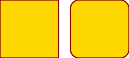

# Scope

This is the scope description.

There may be mutliple paragraphs.

Or even a list:

- wun
- two
- three

## Scope Subsection

Sometimes authors even insert subsections into the scope.

## Glossary

Term
:    Words with special meaning

Design_Term
:    Terms with meaning different from similar words in the natural language.

# References

\[REF-A]
:    Reference A, Stockholm, 2022

\[REF-B]
:    Reference B, Paris, 1821

# Architecture

The top level plan in use for building the best software ever.

Blueprints may link to visuals like \ref{fig:blue-square} and link to them.

{width=98% height=98%}

In some cases backward references to figures like \ref{fig:blue-square} are in use.

It is not always possible to stop organizations from creating deeply nested matrioshka like section trees.

Let us test how this passes the publication or rendering pipeline. 

## Why Not?

Second level heading results in a subsection under our regime.

### This is OK

Third level results in subsubsection.

#### Is this really useful?

Laying out a level four heading should end in a paragraph.

##### Until the Cows Come Home

Overengineering is so much fun.

###### This is not Funny for Anyone

Who knows where we are in the tree and if we evver see the light of the sun again ...

## Lists Maybe?

Unordered, nested, and tight?

- wun
  - wunder
- two
- three
  - hree
    - ree
      - re
        - e
- four

Ordered and tight:

1. uno
1. due
1. tre


And a fenced code block:

```cpp
int main(){}
```

This is all we write about the architecture.

Wait, mermaids!

```{.mermaid background=transparent format=png loc=images filename=alice-and-john caption="Alice and John - Relationship as a Sequence" width=1200}
sequenceDiagram
    Alice->>John: Hello John, how are you?
    John-->>Alice: Great!
```

The auto-generated label should make the reference work like so: \ref{fig:alice-and-john}. Does it?

# Design

Now we really write down details.

Pictures with labels \ref{fig:green} to be injected:

{width=95% height=32px}

And, did it work?

## Tables

A table:

| Left | Middle | Right |
|:-----|:------:|------:|
| L    |   CC   |     R |
| l    |   Cc   |     R |
| L    |   cC   |     r |
A caption \label{tab:sweet-and-lovely}

Some real paragraph of dense text representing deep thoughts about appearance.
Some real paragraph of dense text representing deep thoughts about appearance.
Some real paragraph of dense text representing deep thoughts about appearance.
Some real paragraph of dense text representing deep thoughts about appearance.
Some real paragraph of dense text representing deep thoughts about appearance.
Some real paragraph of dense text representing deep thoughts about appearance.
Some real paragraph of dense text representing deep thoughts about appearance.

A quote:

> That's all folks.

And final words.

### A Final Diagram

Here is a final diagram:

\scale=0.95



We can refer to the diagram (whuch will be scaled to 95% of the page width per
\ref{fig:squares-and-edges} namely the default injected label.

Oh, *cursive* and **bold** ... are easily indicated.

# Abbreviations

ABC
:    Indicator for an alphabet

IO
:    Input Output

UI
:    User Interface

